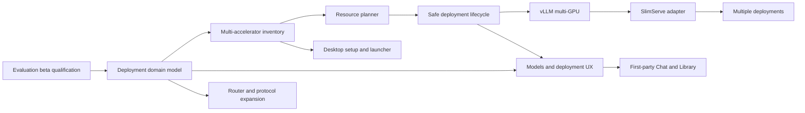

# SovereignStack Development Roadmap

**Status:** Internal working roadmap  
**Purpose:** Give the project owner a dependency-ordered plan from the current public preview to the intended offline, LM Studio-quality, scalable product.  
**Source baseline:** `v0.1.0-rc.6`

## Product outcome

SovereignStack is **ChatGPT in a box, fully offline**: a private AI application that runs on customer-controlled hardware and provides the chat, files, retrieval, APIs, tools, search, identity, and operations users otherwise depend on hosted AI for.

The experience target is:

> Ollama operational simplicity + LM Studio product experience + managed multi-user, multi-engine, multi-GPU inference.

Offline is the default. Cloud models, external search providers, remote support, and online update channels are explicit administrator choices.

## Locked product decisions

1. **The web application is canonical.** It must work on a local workstation, private LAN, and headless GPU server.
2. **Desktop packages gain a small signed setup and launcher shell.** The shell provides guided prerequisites, lifecycle controls, notifications, file dialogs, deep links, and a window around the web application.
3. **Chat becomes a first-party SovereignStack surface.** AnythingLLM may remain temporarily behind internal ingestion and retrieval APIs, but its UI is transitional.
4. **Everyday navigation is Chat, Library, Models, and Activity.** Hardware, people, APIs, operations, and settings are owner/admin destinations.
5. **The curated signed catalog is the default.** Arbitrary Hugging Face, ModelScope, local, and offline artifacts are an Advanced/Community path.
6. **The first multi-GPU semantic is one active model across a selected homogeneous GPU group.** Multiple different models on different GPU groups require the later multi-deployment architecture.
7. **vLLM remains the initial general serving path.** SlimServe is the first additional managed engine. SGLang and general llama.cpp selection follow.
8. **ReAligned Qwen3.5 2B is the proposed lightweight first-chat model.** The reference artifact is BF16 unless a distinct FP16 release is created. The initial GGUF/SlimServe candidate is Q4, provisionally `Q4_K`.
9. **A 16 GB Apple Silicon demo profile is required.** It must demonstrate the complete offline product path with ReAligned 2B and EmbeddingGemma even when speed and model quality are modest. It is a demo tier, distinct from certified production-oriented profiles.
10. **The current evaluator beta may retain the AnythingLLM chat UI.** It must be described as transitional and must not delay initial evaluation.
11. **No empty UI promises.** Engine choices, protocols, hardware support, and modules appear only after their end-to-end path works.

## Release stages

### R0 — Evaluation beta and 16 GB Mac demo

Package and qualify the capabilities that already exist, then add the required low-memory Apple Silicon demo profile.

**User outcome:** Install SovereignStack on a certified host, or launch the explicit 16 GB Mac demo tier; create the first administrator; start a reviewed model; chat with documents; use the OpenAI-compatible API; and exercise the operating controls.

**Scope:** The demo tier proves the complete product path with ReAligned 2B and EmbeddingGemma. It is not a speed, intelligence, concurrency, or production-capacity benchmark. Initial scope remains one active generation model, no first-class GPU placement, and a transitional AnythingLLM UI.

### R1 — Guided model experience

Deliver the LM Studio-quality first-run and model-management experience.

**User outcome:** A normal user installs the product, sees the detected hardware, chooses Fast/Balanced/Best, understands fit before download, follows visible provisioning, and sends the first prompt without documentation.

### R2 — Scalable inference beta

Deliver first-class device placement and managed multi-GPU inference.

**User outcome:** An administrator selects or accepts a recommended homogeneous GPU group, reviews the tensor-parallel plan, and deploys one active model across that group with an observable, recoverable lifecycle.

### R3 — Multi-engine and owned application experience

Integrate SlimServe, begin SGLang/llama.cpp adapters, replace the visible AnythingLLM experience, and broaden protocol compatibility.

**User outcome:** SovereignStack recommends the best validated engine/profile and provides a first-party Chat, Library, Models, and Activity experience.

### R4 — Offline platform expansion

Add multiple managed model deployments, shared knowledge/memory services, offline web search, multimodal modules, and upper-layer workflow/solution integration.

## Critical path



The UI may be prototyped earlier, but production model cards, GPU selection, deployment status, and engine selection must consume these backend contracts rather than inventing frontend-only state.

## Workstreams and milestones

## M0 — Qualify the evaluator beta

**Priority:** P0  
**Release:** R0

### Deliverables

- Freeze the public support matrix and current limitations.
- Distinguish `demo` profiles from certified profiles in manifests, UI copy, documentation, and support expectations.
- Qualify a 16 GB Apple Silicon demo path using ReAligned 2B Q4 plus EmbeddingGemma.
- Change `improve-ux.md` from “implemented” to an honest partial status until its acceptance criteria pass.
- Surface package prerequisite failures outside background log files.
- Verify every visible portal destination; hide any destination that is not functional.
- Add preliminary installation, first-use, API, privacy, troubleshooting, and known-limitations documentation.
- Establish evaluator support, diagnostics, and support-bundle handling.
- Add browser automation for the release-critical journeys.

### Release gate

- Clean `.pkg` installation on a certified Apple Silicon host.
- Clean `.deb` or server installation on a certified Ubuntu/NVIDIA host.
- Clean `.pkg` installation and first-chat journey on an actual 16 GB Apple Silicon Mac.
- The 16 GB demo reaches portal, local generation, embeddings, small-document RAG, and one OpenAI-compatible request without an OOM or restart loop.
- Demo acceptance is functional stability and product visibility; speed, concurrency, and model quality are recorded but are not release gates for this tier.
- First administrator created without host-side credential recovery.
- Recommended model reaches ready state.
- First chat succeeds.
- Document ingestion and cited retrieval succeed.
- Gateway key can be issued and used for an OpenAI-compatible request.
- Backup can be created and verified.
- Support bundle can be generated.
- Every linked page either works or is absent.
- Failures provide a direct action rather than only a log path.

## M1 — Introduce first-class deployment resources

**Priority:** P0  
**Release:** foundation for R1/R2

### Domain objects

- `Accelerator`
- `ModelArtifact`
- `EngineProfile`
- `DeploymentPlan`
- `Deployment`
- `Route`

### Required distinctions

- A **catalog model** is a product-facing reviewed choice.
- A **model artifact** is an exact repository, revision, file, format, quant, checksum, and license.
- An **engine profile** states which engines and configurations may serve that artifact on specific hardware.
- A **deployment plan** is a preflight result and has not changed the active route.
- A **deployment** is a lifecycle-managed runtime instance.
- A **route** gives applications a stable product alias independent of the deployment.

### Acceptance gate

- Versioned schemas and OpenAPI resources exist for all six objects.
- Existing model registry data migrates without loss.
- The current single-runtime configuration can be represented as one deployment.
- No API stores secrets in catalog or deployment records.
- Control can explain the active route, deployment, artifact, engine, and devices without parsing unstructured engine arguments.

## M2 — Build multi-accelerator inventory

**Priority:** P0  
**Release:** R1/R2

### `Accelerator` fields

- Stable GPU UUID
- PCI address
- Vendor and model name
- Architecture
- Compute capability or equivalent
- Total and free VRAM
- Driver and runtime versions
- Topology and NVLink/peer information when available
- Temperature and relevant health state
- Current Sovereign allocation
- Host-visible index as transient display data only

### Rules

- Numeric GPU indexes are not persistent identity.
- Hostd supplies facts the Control container cannot observe reliably.
- Metal unified-memory systems use a platform-specific accelerator representation rather than pretending to have discrete VRAM.
- Unsupported and heterogeneous configurations remain visible but receive actionable incompatibility reasons.

### Acceptance gate

- `GET /hardware` returns `accelerators[]` on Mac and CUDA hosts.
- Reordering CUDA device indexes does not change persistent accelerator identity.
- A four-GPU host reports four independent records and topology.
- Inventory distinguishes total capacity from currently allocatable capacity.
- Unit tests cover UUID stability and incomplete driver/tooling data.

## M3 — Add the resource planner

**Priority:** P0  
**Release:** R1/R2

### Planner inputs

- Model artifact
- Engine profile
- Selected or candidate accelerators
- Context length
- Concurrency target
- Tensor-parallel size
- Quantization
- KV-cache policy
- Embedding placement

### Planner outputs

- Recommended GPU group
- Tensor-parallel plan
- Estimated memory per accelerator
- Estimated total host memory
- Download and storage requirements
- Expected throughput/latency range with confidence level when validated data exists
- Compatibility and certification state
- Reasons for rejection or warnings

### Rules

- Programmatic estimates choose the default; the lightweight model does not configure the system itself.
- Unsupported heterogeneous groups are rejected before download.
- Estimates are labeled measured, modeled, or unknown.
- Unvalidated community configurations may be allowed under Advanced with explicit warnings.

### Acceptance gate

- Planning has no runtime side effects.
- Insufficient VRAM, host RAM, or disk is detected before download.
- Context and concurrency changes update the estimate.
- Estimated memory is recorded alongside observed peak memory after deployment.
- Release profiles define acceptable estimate error bounds.

## M4 — Make model deployment safe and resumable

**Priority:** P0  
**Release:** R1/R2

### Lifecycle

```text
Preflight → Download → Verify → Stage → Drain → Load → Smoke test → Route
```

### Invariants

- The old model continues serving during Preflight, Download, Verify, and Stage.
- Runtime disruption starts only at Drain/Load.
- Verification failure never modifies the active route.
- Every stage has a stable status, progress, cancellation policy, retry boundary, and recovery action.
- A failed candidate restores the previous configuration and route.
- Blue/green switching is offered only when spare compatible GPUs exist.

### Acceptance gate

- Model weights can download before Runtime restart.
- Interrupted downloads resume or restart safely without corrupting the artifact cache.
- Cancel before Drain leaves the active model untouched.
- Failure during Load or Smoke test restores the prior route.
- Activity survives browser refresh and Control restart.
- The UI can report bytes, transfer rate, ETA, verification, load, and smoke-test progress.

## M5 — Qualify the initial curated model set

**Priority:** P0  
**Release:** R1

### Proposed choices

- **Fast:** ReAligned Qwen3.5 2B
- **Balanced:** hardware-class-specific reviewed model
- **Best Quality:** largest validated fit for the detected hardware
- **Embedding:** EmbeddingGemma as the normal default

### ReAligned qualification

- Pin `Lazarus-Ai/ReAligned-Qwen3.5-2B` reference weights at an immutable revision.
- Decide whether the general reference is the published BF16 artifact or a new true FP16 artifact.
- Pin `Lazarus-Ai/ReAligned-Qwen3.5-2B-GGUF` `Q4_K` as the initial 16 GB Mac and SlimServe candidate unless qualification selects another Q4 artifact.
- Record exact checksums and licenses.
- Validate prompt template, tool calling, reasoning behavior, context, memory, cold start, and representative chat quality.
- Measure the complete appliance on an actual 16 GB Apple Silicon Mac with generation and EmbeddingGemma active.
- Add a SlimServe profile only after SlimServe supports this architecture/quant/configuration and passes the profile gate.
- Treat any new small vision-tower or multimodal artifact as an experimental profile until its model identity, license, memory, and runtime path are qualified.

### 16 GB Mac demo profile

- **Generation:** ReAligned Qwen3.5 2B Q4, provisionally `Q4_K`.
- **Embedding:** EmbeddingGemma with the same stable embedding identity used elsewhere.
- **Runtime:** Prefer the simplest reliable Apple Metal path for the demo; do not block the demo on SlimServe integration.
- **Workload:** One user, one active generation model, small document set, conservative context, and conservative concurrency.
- **Required journey:** install → first administrator → local model ready → first chat → small document RAG → API key → one local API request.
- **Positioning:** Demonstrates the application and offline operating loop. It does not imply production throughput, strong 2B-model intelligence, or the certified capacity of larger profiles.
- **Experimental option:** If the small multimodal/vision-tower work lands, expose it as a separate experimental demo profile rather than replacing the stable text path.

### Acceptance gate

- Each catalog entry has immutable artifact identity and checksums.
- Each choice has minimum/recommended memory, disk, context, and capability metadata.
- “Recommended” selects among multiple compatible choices.
- The first-chat default works without a provider key.
- Release notes state the intended purpose and limitations of the 2B model.
- The 16 GB Mac demo journey passes on physical 16 GB hardware with no cloud provider and no memory-related restart loop.
- Observed memory, first-token latency, and tokens per second are recorded even though they are not pass/fail thresholds for the demo tier.

## M6 — Build the guided setup and native launcher

**Priority:** P0  
**Release:** R1

### Desktop setup responsibilities

- Detect OS and architecture.
- Detect Docker/Desktop or Engine status.
- Detect NVIDIA driver and container-toolkit state.
- Display accelerator, RAM, disk, and network inventory.
- Provide exact remediation actions such as Open Docker, Retry, Choose storage, or Download diagnostics.
- Persist progress across application restart and reboot where possible.
- Start/stop the appliance and display status.
- Open the canonical web application.
- Provide native notifications, file dialogs, and deep links.

### Onboarding flow

1. Install
2. Preflight
3. Create administrator
4. Review the recommended model/deployment plan
5. Download and provision
6. Validate readiness
7. Send the first prompt

### Acceptance gate

- Ordinary desktop users do not need Terminal for supported installation.
- Missing Docker/driver/toolkit produces a visible guided failure.
- Desktop defaults to local-only access without asking a networking question.
- Headless installation presents a reachable private-LAN URL.
- A new user reaches the first prompt without external documentation.

## M7 — Redesign the application information architecture

**Priority:** P0  
**Release:** R1

### Everyday navigation

- Chat
- Library
- Models
- Activity

### Administration

- Hardware & Deployments
- People & Access
- API
- Operations
- Settings

### Operations contains

- System health
- Grafana
- Phoenix
- Evaluations
- Backups and restore
- Updates
- Repair
- Diagnostics and support bundles

### Acceptance gate

- Infrastructure destinations do not compete visually with Chat.
- Embeddings are a Library implementation detail in normal mode.
- Advanced embedding identity and index controls remain available to administrators.
- Role-gated navigation works at desktop and mobile sizes.
- Every route has loading, empty, error, and degraded states.

## M8 — Deliver explicit vLLM multi-GPU deployment

**Priority:** P0  
**Release:** R2

### Initial scope

- One active generation deployment
- One homogeneous selected GPU group
- Tensor-parallel size derived from the plan
- Selected devices passed end-to-end
- Dedicated embedding placement included in the plan

### Device path

```text
Control deployment plan
→ hostd/restricted Docker proxy
→ container device visibility
→ engine tensor-parallel arguments
→ runtime manifest
→ smoke and observed-memory validation
```

### Acceptance gate

- Selecting GPUs by UUID results in exactly those physical devices being visible to Runtime.
- Runtime manifest reports selected UUIDs and tensor-parallel size.
- Invalid or unsupported GPU groups fail before download.
- A multi-GPU smoke test exercises generation through the public gateway route.
- Restart, repair, backup, update, and support bundles preserve or report deployment state correctly.
- Clean-system qualification includes at least one supported multi-GPU Ubuntu configuration.

## M9 — Integrate SlimServe as the second managed engine

**Priority:** P1 after the deployment contract and vLLM path are stable  
**Release:** R3

### Adapter responsibilities

- Discover compatible SlimServe profiles.
- Resolve exact model, quant, and drafter artifacts.
- Validate platform and GPU count.
- Produce planner estimates from profile data.
- Download and verify every profile artifact.
- Start, monitor, stop, repair, and smoke-test the deployment.
- Publish runtime manifest, metrics, errors, and supported API capabilities.

### Profile gate

A SlimServe profile is recommended only when it records:

- Exact platform and accelerator identity
- Exact GPU count
- Exact model and quant
- Exact artifact revisions and checksums
- Engine/runtime configuration
- Context and concurrency limits
- Measured memory, throughput, latency, and cold-start results
- Reproducible validation commands

### Acceptance gate

- The same deployment APIs and Activity lifecycle operate vLLM and SlimServe.
- A user sees why SlimServe is or is not recommended.
- No engine-specific flags leak into normal mode.
- Falling back to vLLM is explicit and does not silently alter the chosen model.
- Performance claims cite the exact profile baseline.

## M10 — Own the Chat and Library experience

**Priority:** P1; may proceed in parallel after stable route, library, and job APIs  
**Release:** R3

### Chat capabilities

- Conversation list and folders
- Model selector in the composer
- Attachments, drag-and-drop, and paste
- Streaming and stop
- Retry, edit-and-continue, branching, and copy
- Citations and source inspection
- Collapsible reasoning when supported
- Capability-driven image, audio, file, and tool controls
- Per-chat tool selection and approval
- Persistent local/privacy indicator

### Library capabilities

- Uploaded files and folders
- Ingestion and indexing progress
- Retrieval/citation inspection
- Index version and active embedding identity for administrators
- Clear reindex impact and rollback status

### Transition rule

AnythingLLM may remain as an internal ingestion/retrieval implementation temporarily, but no new user-facing product dependency should be added to its iframe UI.

### Acceptance gate

- First-party Chat works without loading the AnythingLLM UI.
- File ingestion and retrieval continue using supported internal contracts.
- Conversation and file permissions follow Sovereign Control identity.
- Core Chat remains usable when Grafana, Phoenix, updates, or other optional tools are unavailable.

## M11 — Replace/extend the gateway and compatibility surface

**Priority:** P1  
**Release:** R3

### Current

- OpenAI Chat Completions
- OpenAI Completions
- OpenAI Embeddings
- Stable product aliases and scoped keys through LiteLLM

### Target

- OpenAI Responses
- Anthropic Messages
- Gemini-compatible ingress
- Lazarus router replacing LiteLLM after parity qualification

### Acceptance gate

- Official SDK compatibility journeys pass for each advertised protocol.
- Streaming, tools, reasoning, errors, usage, and cancellation receive explicit compatibility tests.
- Scoped keys, budgets, model allowlists, RPM, and TPM behavior survive router replacement.
- Existing OpenAI-compatible client integrations require only base URL, credential, and model alias changes.
- LiteLLM is removed only after every used feature has a tested replacement.

## M12 — Multiple model deployments

**Priority:** P2  
**Release:** R4

### Required architecture

- Multiple deployment records and runtime instances
- Per-deployment device allocation
- Route-to-deployment mapping
- GPU conflict prevention
- Independent health and lifecycle
- Placement-aware model switching
- Capacity accounting across deployments

### Acceptance gate

- Two different models can run on disjoint GPU groups.
- Starting one deployment cannot over-allocate another deployment's devices.
- The gateway routes stable aliases to the correct deployment.
- Failure or restart of one deployment does not reload another.
- The UI clearly distinguishes downloaded artifacts, stopped deployments, active deployments, and routes.

## M13 — Offline search and multimodal modules

**Priority:** P2/P3  
**Release:** R4+

### Local web search appliance

Before selecting a storage number or appliance SKU, define:

- Corpus sources and legal/licensing constraints
- Coverage target
- Freshness target
- Ingestion and update method
- Inverted-index format
- Query latency and relevance targets
- Storage, RAM, and CPU requirements
- Retrieval and citation contract
- Backup/rebuild strategy
- Air-gap bundle/update process

The customer-facing promise is an optional locally indexed web corpus, not a fixed 25 TB or 250 TB number until the design is benchmarked.

### Multimodal modules

- Voice input/output
- Image generation
- Video generation
- Multimodal embeddings and retrieval
- Capability-aware UI controls
- Independent installation, hardware, and license requirements

## Release-critical browser journeys

These journeys are product contracts, not incidental UI tests:

1. 16 GB Mac demo install → ReAligned 2B Q4 + EmbeddingGemma → first chat → small document RAG → local API request
2. Certified Mac install → first administrator → recommended model → first chat
3. Headless install → reachable LAN URL → first administrator → first chat
4. Alternative curated model selection
5. Insufficient RAM/VRAM/disk detected before download
6. Interrupted download → retry/resume → successful deployment
7. Failed model load → previous route restored
8. Document upload → index → query → citation
9. Create user invitation → accept → role-gated Chat
10. Issue scoped gateway key → valid request → rejected disallowed model
11. Backup → verify → restore impact confirmation
12. Repair an unhealthy optional service without losing Chat
13. Offline bundle install and first chat without internet access
14. Selected multi-GPU group → correct devices and tensor-parallel plan
15. SlimServe-compatible host receives a SlimServe recommendation
16. SlimServe-incompatible host receives a clear fallback explanation

## Project-owner action list

### Immediate

1. Approve this roadmap's locked product decisions.
2. Freeze R0 support matrix, limitations, and release naming.
3. Secure repeatable test access to:
   - certified Apple Silicon hardware;
   - physical 16 GB Apple Silicon hardware for the required demo tier;
   - certified single-GPU Ubuntu/NVIDIA hardware;
   - intended multi-GPU Ubuntu/NVIDIA hardware.
4. Turn M0–M11 into issue-tracker epics with one accountable owner each.
5. Make M1 deployment resources the shared backend/frontend contract.
6. Create the first browser journey before expanding product scope.
7. Begin ReAligned BF16/FP16 and Q4 artifact qualification.
8. Change `improve-ux.md` status to reflect reality.
9. Run a weekly product demo against release journeys rather than component checklists.
10. Add calendar dates only after owners, staffing, and hardware access are committed.

### Weekly review

- Which release journey became demonstrably complete?
- Which visible path is broken and should be fixed or hidden?
- Which roadmap claim lacks a corresponding schema, API, job, or test?
- Which estimate differs materially from observed memory/performance?
- Which dependency blocks the critical path?
- Are roadmap features accidentally being described as beta capabilities?

## Product success measures

Measure locally and expose to administrators; transmit nothing without explicit opt-in.

- Install success rate by supported profile
- Time from installer launch to portal
- Time from portal to first prompt
- Percentage of first-time users completing setup unaided
- Model download/load failure rate by stable error code
- Recovery rate through Retry or Repair
- Estimated versus observed memory error
- Deployment success rate by engine/profile
- First-token latency and throughput by validated profile
- API compatibility journey pass rate
- Number of ordinary user journeys requiring Terminal
- Number of visible but nonfunctional navigation destinations

## Principal risks

| Risk | Consequence | Control |
| --- | --- | --- |
| “Everything ChatGPT does” becomes one undifferentiated scope | Beta never ships | Treat search, multimodal, tools, and upper applications as explicit staged modules |
| UI is designed before deployment contracts | UI promises impossible placement or state | Land schemas and APIs before production controls |
| Multi-GPU is interpreted as multi-model | Architecture is under-scoped | Keep first semantic to one model across one homogeneous GPU group |
| ReAligned 2B is treated as the primary quality model for every deployment | Poor evaluation impression | Position it as the lightweight demo/first-chat model; recommend larger validated choices when hardware allows |
| Memory estimates are presented as guarantees | OOM or poor performance | Label confidence and compare estimates with observed peaks |
| SlimServe is marketed with universal multipliers | Credibility loss | Publish profile-specific reproducible benchmarks only |
| AnythingLLM UI becomes permanent through incremental additions | Product never feels unified | Freeze visible feature investment and migrate through internal contracts |
| Router replacement drops policy features | API/security regression | Inventory and test every LiteLLM feature used before cutover |
| Offline search begins with a storage SKU instead of requirements | Wrong architecture and cost | Define corpus, freshness, relevance, and update requirements first |
| Supported hardware matrix expands faster than qualification | Release instability | Fail closed and add profiles only through release gates |

## Definition of the intended product experience

SovereignStack reaches the target when a first-time user on supported hardware can:

1. Install through a signed package or documented server command.
2. Resolve every prerequisite through a visible guided action.
3. Create the first administrator in the application.
4. See what hardware is available and how it is allocated.
5. Accept a reviewed model/engine/deployment plan without registry expertise.
6. Understand download, verification, load, validation, and recovery progress.
7. Send the first prompt and attach a file.
8. Understand which model is active and why it fits.
9. Issue an API key and redirect an existing application.
10. Operate fully offline unless an administrator explicitly enables an external capability.
11. Add users and manage access without exposing infrastructure tools.
12. Update, repair, back up, restore, and diagnose the appliance without container access.
13. Use advanced model, embedding, engine, and GPU controls when needed without exposing them to normal users.
